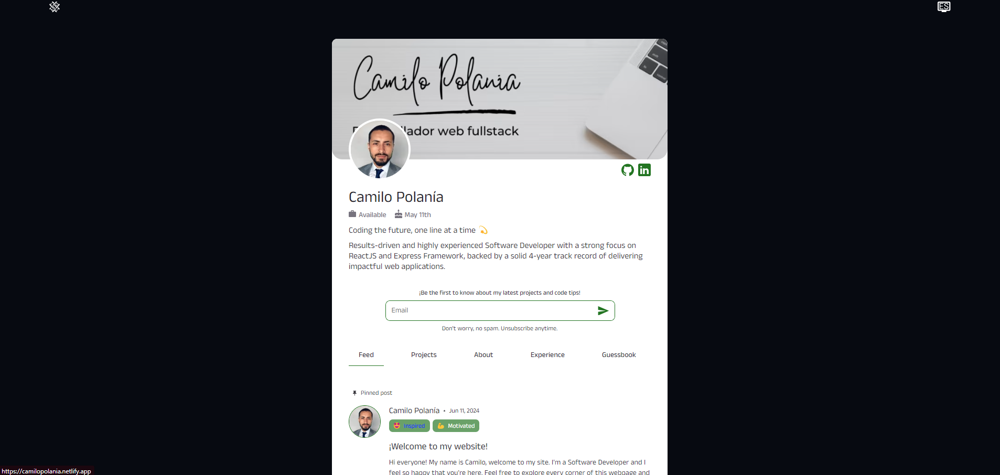
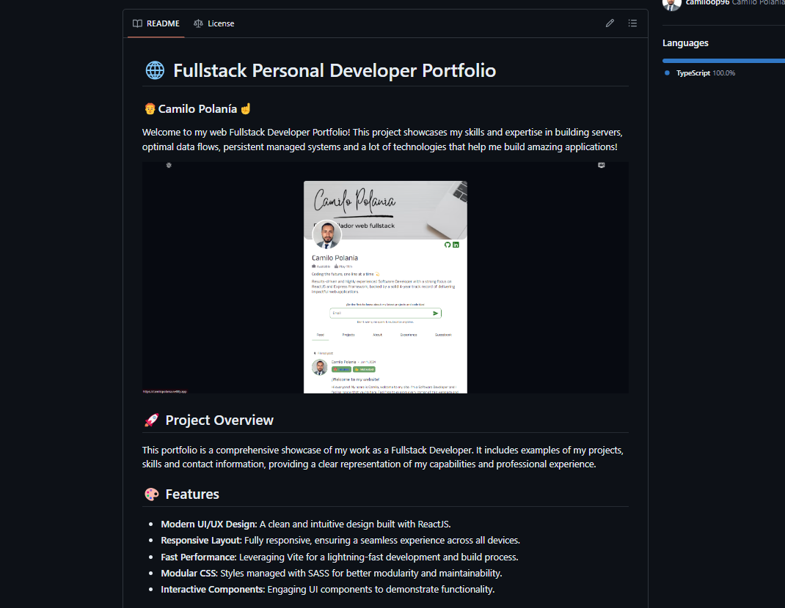

# 🌐 Fullstack Personal Developer Portfolio (Backend Focus)

### 👨‍🦰Camilo Polanía☝️

This portfolio is a comprehensive showcase of my work as a Fullstack Developer with a strong focus on backend development. It includes examples of my projects, skills, and contact information, providing a clear representation of my capabilities and professional experience.



## 🚀 Project Overview

This portfolio is a comprehensive showcase of my work as a Fullstack Developer with a strong focus on backend development. It includes examples of my projects, skills, and contact information, providing a clear representation of my capabilities and professional experience.

## 🎨 Features

- **Robust Server-side Logic**: Built with Express.js to handle server-side logic efficiently.
- **Database Integration**: Uses MongoDB for data storage and management.
- **API Development**: Implements RESTful APIs for seamless data exchange.
- **Authentication and Authorization**: Secure mechanisms for user authentication and role-based access control.
- **Performance Optimization**: Techniques and tools to ensure optimal server

## 🛠️ Technologies Used

- **Backend**:
  - [Node.js](https://nodejs.org/)
  - [Express](https://expressjs.com/)
  - [MongoDB](https://www.mongodb.com/)

## 📸 Screenshots




## 📚 Getting Started

### Prerequisites

Make sure you have [Node.js](https://nodejs.org/) installed on your machine.

### Installation

1. Clone the repository:
   ```bash
   git clone https://github.com/camiloop96/portfolio-server.git
   cd portfolio
   ```
2. Install dependencies:

```bash
npm install
```

3. Run the development server:

```bash
npm run dev
```

4. Open your browser and navigate to http://localhost:3000.

📬 Contact
Feel free to reach out if you have any questions or want to collaborate on a project!

- Email: cpolania96@outlook.com
- GitHub: [camiloop96](https://github.com/camiloop96)

🙌 Acknowledgements
Special thanks to the creators of NodeJS, MongoDB and all the wonderful tools used in this project.

📜 License
This project is licensed under the Non-Distribution License - see the LICENSE file for details.
